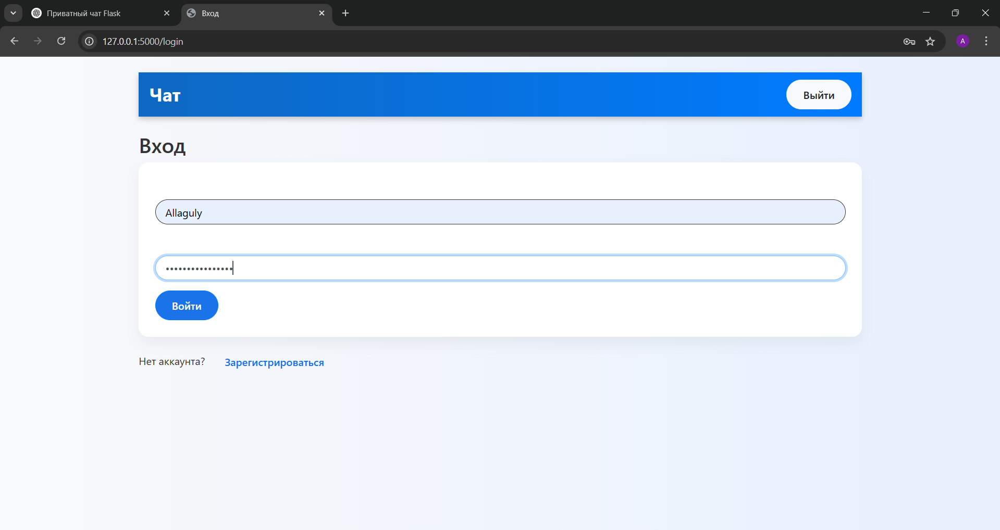
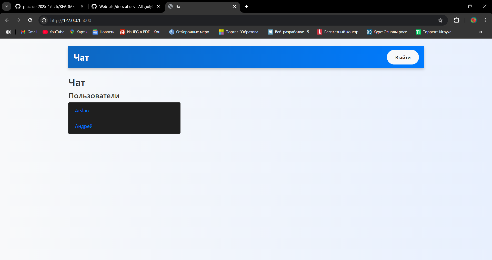
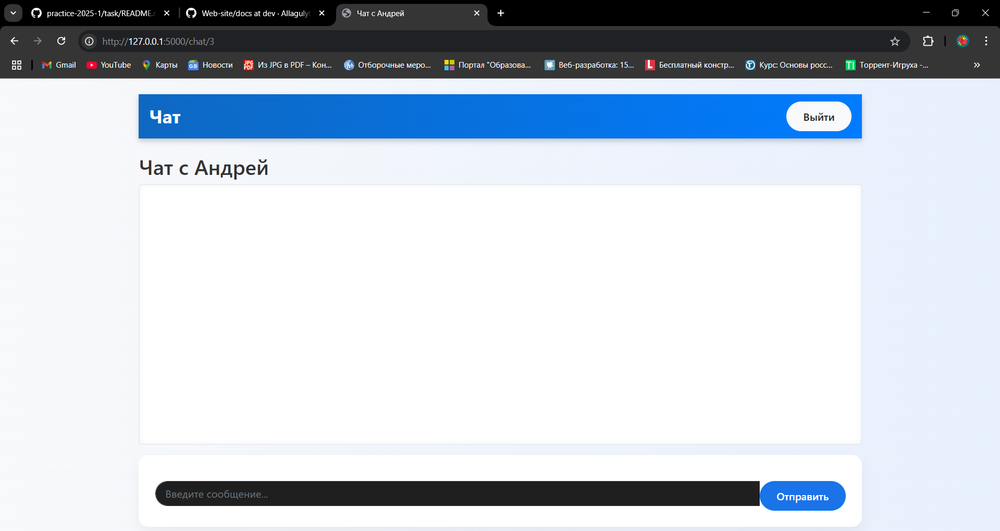
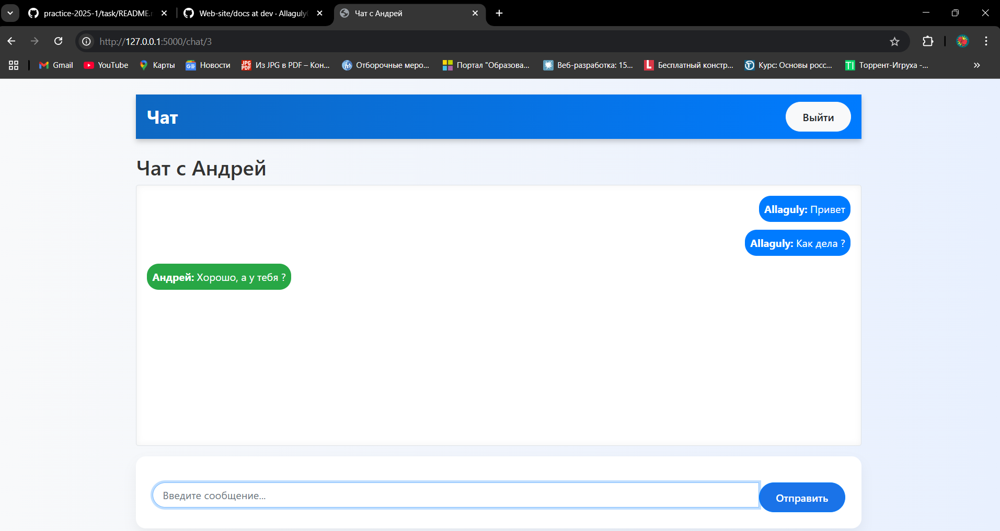
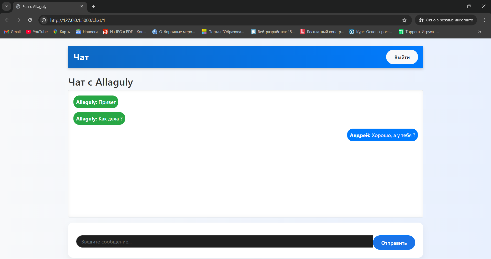
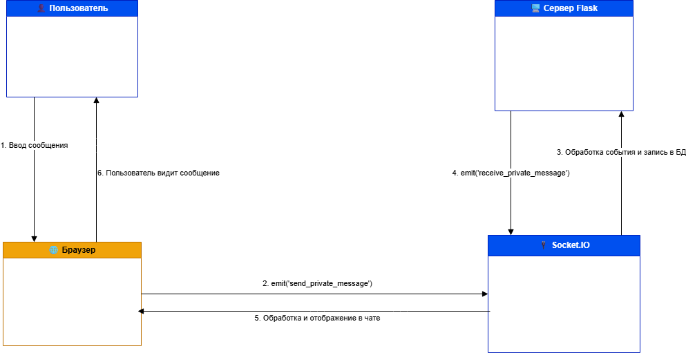
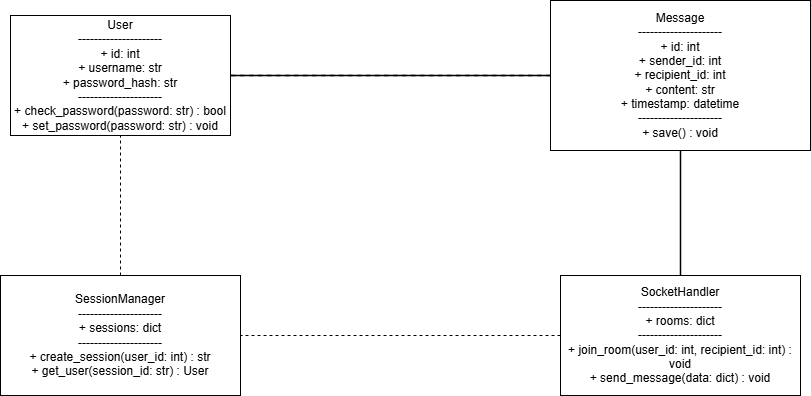

# 💬 Веб-месседжер на Flask + Socket.IO

## 📌 Цель проекта

Создать веб-приложение, позволяющее:
- Регистрироваться и входить в систему
- Выбирать собеседника из списка пользователей
- Вести приватный чат в реальном времени (через WebSocket)
- Сохранять историю сообщений

---

## 🔍 Этапы разработки

### 1. Исследование предметной области
- Что нужно пользователю? Простая, приватная переписка.
- Минимальные требования: регистрация, вход, список пользователей, чат, история, обмен сообщениями.
1. Основы клиент-серверной архитектуры
Как работает взаимодействие между пользователем (браузером) и сервером.
Разница между HTTP-запросами (регистрация, вход, получение чатов) и WebSocket (непрерывный обмен сообщениями).
2. Что такое WebSocket и зачем он нужен
WebSocket — это технология, позволяющая установить постоянное соединение между клиентом и сервером.
Подходит для чатов, потому что не нужно обновлять страницу при каждом новом сообщении.
Используется через библиотеку Socket.IO.
3. Модель данных для чата
Нужно минимум две сущности:
User: хранит имя и пароль (зашифрованный).
Message: хранит отправителя, получателя, текст сообщения и время.
Каждое сообщение должно иметь ссылку на двух пользователей: кто отправил и кто получил.
4. Принципы аутентификации
Пользователь должен зарегистрироваться и затем входить в систему.
После входа создаётся сессия, чтобы сервер «помнил» пользователя.
Используется session в Flask и werkzeug.security для хэширования паролей.
5. Формирование комнат (rooms) в чате
Для приватного общения важно, чтобы сообщение было видно только двум пользователям.
Решение: создавать уникальную комнату (room), основанную на id пользователей, например 1_3.
Оба участника присоединяются к одной комнате и обмениваются сообщениями внутри неё.
6. Обновление сообщений в реальном времени
Сервер реагирует на событие send_private_message, сохраняет сообщение и рассылает его всем в комнате.
Клиент (браузер) получает это сообщение с помощью слушателя receive_private_message и добавляет его в интерфейс.
7. Как хранить историю сообщений
Каждое сообщение сохраняется в базе данных (SQLite) с указанием отправителя и получателя.
При заходе в чат отображается полная история общения между двумя пользователями.
8. Основы HTML/CSS/Bootstrap
Для отображения формы входа, списка пользователей, области чата.
Используется фреймворк Bootstrap — ускоряет стилизацию.
9. Работа Flask с шаблонами Jinja2
Jinja2 позволяет внедрять Python-код в HTML.
Через render_template() можно передать данные в шаблон и отобразить нужную информацию (например, список пользователей или сообщений).
### 2. Выбор стека технологий
| Компонент         | Технология             | Назначение                             |
|------------------|------------------------|----------------------------------------|
| Backend          | Flask                  | Python-фреймворк для веб-приложений    |
| Realtime         | Flask-SocketIO         | WebSocket для обмена сообщениями       |
| База данных      | SQLite + SQLAlchemy    | Хранение пользователей и сообщений     |
| Frontend         | HTML, Bootstrap        | Удобный UI                             |
| Шаблоны          | Jinja2                 | Динамическая генерация страниц         |

### 3. Структура проекта
```
chat-app/
├── app.py # Главный файл Flask-приложения
├── templates/ # HTML-шаблоны (Jinja2)
│ ├── base.html
│ ├── index.html
│ ├── login.html
│ ├── register.html
│ └── chats.html
├── static/
│ └── style.css # Стили (опционально)
├── chat.db # SQLite база данных
```
---

## 🛠 Установка и запуск

### 1. Клонируем репозиторий и устанавливаем зависимости:

```bash
pip install flask flask_sqlalchemy flask_socketio eventlet werkzeug
python app.py
```
Шаг 1: Установка зависимостей

Создай виртуальное окружение и установи нужные библиотеки:
```
python -m venv venv
source venv/bin/activate  # Windows: venv\Scripts\activate
pip install flask flask-socketio flask_sqlalchemy werkzeug
```
---

Шаг 2: Создание app.py
```
from flask import Flask, render_template, request, redirect, url_for, session
from flask_sqlalchemy import SQLAlchemy
from flask_socketio import SocketIO, emit, join_room
from werkzeug.security import generate_password_hash, check_password_hash
from datetime import datetime
import os

app = Flask(__name__)
app.secret_key = os.urandom(24)

# Настройка базы данных
app.config['SQLALCHEMY_DATABASE_URI'] = 'sqlite:///chat.db'
app.config['SQLALCHEMY_TRACK_MODIFICATIONS'] = False
db = SQLAlchemy(app)
```
---

# Инициализация SocketIO
socketio = SocketIO(app)

Шаг 3: Модели данных
```
class User(db.Model):
    id = db.Column(db.Integer, primary_key=True)
    username = db.Column(db.String(100), unique=True, nullable=False)
    password = db.Column(db.String(200), nullable=False)

class Message(db.Model):
    id = db.Column(db.Integer, primary_key=True)
    sender_id = db.Column(db.Integer, db.ForeignKey('user.id'), nullable=False)
    recipient_id = db.Column(db.Integer, db.ForeignKey('user.id'), nullable=False)
    content = db.Column(db.Text, nullable=False)
    timestamp = db.Column(db.DateTime, default=datetime.utcnow)

    sender = db.relationship('User', foreign_keys=[sender_id])
    recipient = db.relationship('User', foreign_keys=[recipient_id])
```
--- 
Шаг 4: Маршруты Flask
```
@app.route('/')
def index():
    if 'user_id' not in session:
        return redirect(url_for('login'))
    user = User.query.get(session['user_id'])
    users = User.query.filter(User.id != user.id).all()
    return render_template('index.html', user=user, users=users)

@app.route('/register', methods=['GET', 'POST'])
def register():
    if request.method == 'POST':
        username = request.form['username']
        password = generate_password_hash(request.form['password'])

        if User.query.filter_by(username=username).first():
            return "Пользователь с таким именем уже существует"

        user = User(username=username, password=password)
        db.session.add(user)
        db.session.commit()
        return redirect(url_for('login'))
    return render_template('register.html')

@app.route('/login', methods=['GET', 'POST'])
def login():
    if request.method == 'POST':
        username = request.form['username']
        password = request.form['password']

        user = User.query.filter_by(username=username).first()
        if user and check_password_hash(user.password, password):
            session['user_id'] = user.id
            return redirect(url_for('index'))
        return render_template('login.html', error="Неверный логин или пароль", username=username)
    return render_template('login.html')

@app.route('/logout')
def logout():
    session.pop('user_id', None)
    return redirect(url_for('login'))

@app.route('/chat/<int:recipient_id>')
def private_chat(recipient_id):
    if 'user_id' not in session:
        return redirect(url_for('login'))

    user = User.query.get(session['user_id'])
    recipient = User.query.get(recipient_id)

    messages = Message.query.filter(
        ((Message.sender_id == user.id) & (Message.recipient_id == recipient.id)) |
        ((Message.sender_id == recipient.id) & (Message.recipient_id == user.id))
    ).order_by(Message.timestamp).all()

    return render_template('chats.html', user=user, recipient=recipient, messages=messages)
```
---
Шаг 5: Обработчики Socket.IO
```
@socketio.on('join')
def on_join(data):
    room = f"{min(session['user_id'], data['recipient_id'])}_{max(session['user_id'], data['recipient_id'])}"
    join_room(room)

@socketio.on('send_private_message')
def handle_private_message(data):
    sender = User.query.get(session['user_id'])
    content = data['message'].strip()
    recipient_id = data['recipient_id']
    if not content:
        return

    message = Message(sender_id=sender.id, recipient_id=recipient_id, content=content)
    db.session.add(message)
    db.session.commit()

    room = f"{min(sender.id, recipient_id)}_{max(sender.id, recipient_id)}"
    emit('receive_private_message', {
        'username': sender.username,
        'content': content,
        'user_id': sender.id
    }, room=room)
```
---
Шаг 6: Инициализация базы данных
```
@app.cli.command('init-db')
def init_db():
    db.create_all()
    print("База данных инициализирована.")

---
Шаг 7: HTML-шаблоны (templates/)

base.html — базовый шаблон (навигация, стили)

index.html — список пользователей с ссылками на чат

register.html / login.html — формы регистрации и входа

chats.html — окно диалога + подключение Socket.IO:
```
---
```
<script>
var socket = io();
var currentUserId = {{ user.id }};
var recipientId = {{ recipient.id }};
var room = `${Math.min(currentUserId, recipientId)}_${Math.max(currentUserId, recipientId)}`;

socket.emit('join', { recipient_id: recipientId });

document.getElementById('chat-form').addEventListener('submit', function(e) {
    e.preventDefault();
    var messageInput = document.querySelector('input[name="message"]');
    var message = messageInput.value;
    if (message.trim() === "") return;

    socket.emit('send_private_message', {
        message: message,
        recipient_id: recipientId
    });

    messageInput.value = '';
});

socket.on('receive_private_message', function(data) {
    if (data.user_id !== currentUserId && recipientId !== data.user_id) return;

    var chatBox = document.getElementById('chat-box');
    var newMessage = document.createElement('div');
    var isSender = currentUserId === data.user_id;
    newMessage.className = 'd-flex ' + (isSender ? 'justify-content-end' : 'justify-content-start');
    newMessage.innerHTML = `<span class="p-2 text-white bg-${isSender ? 'primary' : 'success'}">
                                <strong>${data.username}:</strong> ${data.content}
                            </span>`;
    chatBox.appendChild(newMessage);
    chatBox.scrollTop = chatBox.scrollHeight;
});
</script>
```
--- 
Шаг 8: Запуск приложения
```
flask run
# или
python app.py
```
---
Иллюстрация
## 📸 Интерфейс

### 📌 Страница входа



### 📌 Главная страница



### 📌 Чат с пользователем





---

# 📌Диаграмма компонентов
Диаграмма компонентов (UML Component Diagram) показывает структурные части (компоненты) системы и их взаимодействия. Она полезна для понимания, как разбит проект на модули и как они связаны между собой.

# 🔧 Что изображено на диаграмме
Компонент	Тип (Форма)	Назначение
Web Browser	🟢 Элипс	Клиентская часть, с которой работает пользователь. Загружает веб-страницу, подключается к Flask через WebSocket или HTTP.
Flask Server (app.py)	🟦 Прямоугольник	Основное серверное приложение, написанное на Python с использованием Flask. Обрабатывает запросы, управляет логикой, событиями и отправкой данных.
Database (SQLite)	🟣 Цилиндр	Локальная база данных, где хранятся сообщения, пользователи и другие данные проекта.

# 🔁 Связи между компонентами (стрелки)
От кого → Кому	Что означает
Web Browser → Flask Server	Браузер отправляет запрос (например, через Socket.IO или HTTP).
Flask Server → Database	Сервер обращается к БД для чтения/записи данных.

# 🎯 Какую функцию выполняет диаграмма?
Эта диаграмма помогает:

Понять архитектуру проекта — какие главные модули есть и как они связаны.

Показать зависимости — например, Flask зависит от базы данных.

Объяснить структуру другим — отличная часть для документации, презентации или защиты проекта.

Упростить масштабирование — можно быстро увидеть, куда можно добавить компоненты (например, Redis или внешнюю API).

# 🔍 Как это связано с  проектом (чатом на Flask + Socket.IO):
Web Browser — загружает клиент JS, подключается по WebSocket.

Flask Server — через app.py обрабатывает Socket.IO события (send_private_message, receive_private_message и т.д.).

SQLite — хранит сообщения, пользователей, историю и другую информацию.

--- 
# 📌 Диаграмма последовательности
Диаграмма последовательности (или Sequence Diagram) — это вид UML-диаграммы, который описывает временную последовательность взаимодействий между различными компонентами системы.

Она показывает, как сообщение проходит путь от пользователя до сервера и обратно, в контексте архитектуры:
Пользователь → Браузер → Socket.IO → Сервер (Flask) → обратно.

# 🎯 Какую функцию выполняет?
Эта диаграмма:

✅ Документирует логику взаимодействия компонентов чата в реальном времени.

✅ Помогает понимать порядок вызовов и событий в процессе отправки сообщения.

✅ Полезна для разработчиков и тестировщиков, чтобы видеть, кто и когда вызывает каждое действие.

✅ Может использоваться при обсуждении архитектуры, дизайна API, отладке ошибок, обучении новых участников команды.

# 🔄 Что отображено в диаграмме?
Компонент	Роль и функция
👤 Пользователь	Вводит текстовое сообщение в интерфейсе
🌐 Браузер	Обрабатывает ввод, вызывает emit() событие Socket.IO
🔌 Socket.IO	Выступает как транспортный слой между фронтендом и сервером
🖥️ Сервер Flask	Обрабатывает полученное событие, сохраняет сообщение в БД, отправляет ответное событие

# 🔁 Этапы процесса:
№	Описание действия
1	Пользователь вводит сообщение в браузере
2	Браузер вызывает emit('send_private_message') и отправляет событие через Socket.IO
3	Socket.IO на сервере обрабатывает событие и сохраняет сообщение в БД
4	Сервер возвращает событие receive_private_message обратно через Socket.IO
5	Браузер отображает полученное сообщение в чате
6	Пользователь видит результат

# 📘 Зачем это нужно?
🔧 Для визуализации процесса общения в чате (чтобы понимать, кто что делает и в какой момент).

💡 Для оптимизации логики (например, можно видеть задержки или лишние шаги).

🧪 Для тестирования и отладки — можно сверяться с диаграммой, проверяя, все ли события срабатывают.

📚 Для технической документации проекта — полезно при командной разработке или передаче проекта.

---
# UML Диаграмма Классов — Чат-приложение
## 📌 Назначение
Данная диаграмма классов описывает архитектуру серверной части чат-приложения. Она помогает визуализировать ключевые классы, их свойства, методы и связи между ними. Используется для проектирования, документирования и поддержки кода.

# 📦 Классы
🔹 User
Описание: Представляет пользователя системы.

Свойства:

id: int — уникальный идентификатор пользователя.

username: str — имя пользователя.

password_hash: str — хэшированный пароль.

Методы:

check_password(password: str): bool — проверяет правильность пароля.

set_password(password: str): void — устанавливает хэш пароля.


# 🔹 Message
Описание: Отвечает за хранение и обработку сообщений.

Свойства:

id: int — идентификатор сообщения.

sender_id: int — ID отправителя.

recipient_id: int — ID получателя.

content: str — текст сообщения.

timestamp: datetime — дата и время отправки.

Методы:

save(): void — сохраняет сообщение в базе данных.

# 🔹 SessionManager
Описание: Управляет пользовательскими сессиями.

Свойства:

sessions: dict — коллекция активных сессий.

Методы:

create_session(user_id: int): str — создаёт новую сессию.

get_user(session_id: str): User — возвращает пользователя по ID сессии.

# 🔹 SocketHandler
Описание: Обрабатывает сокет-события и логики обмена сообщениями.

Свойства:

rooms: dict — информация о комнатах.

Методы:

join_room(user_id: int, recipient_id: int): void — подключает пользователя к комнате.

send_message(data: dict): void — отправляет сообщение через сокет.

# 🔗 Связи между классами
От	Кому	Тип связи	Описание
Message	User	Ассоциация	sender_id и recipient_id ссылаются на User.
SessionManager	User	Зависимость	Использует данные пользователей.
SocketHandler	SessionManager	Зависимость	Обращается к данным сессий.
SocketHandler	Message	Ассоциация	Отправляет сообщения.